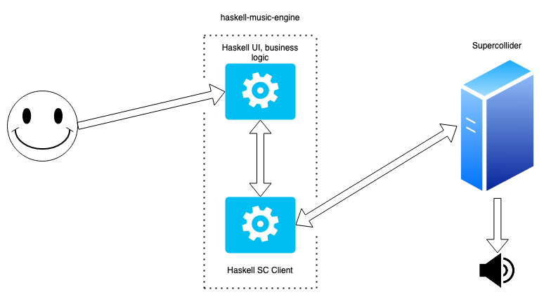

# **Real-World Haskell**

University of Bucharest

28 November 2022

---

# A bit about me

- Full time Haskeller at [Runtime Verification, Inc.](https://runtimeverification.com/)
- Our project: A symbolic execution engine and automated prover for the K language
    - over 150k lines of open-source Haskell code: https://github.com/runtimeverification/haskell-backend
    - more about the K language and framework: https://kframework.org/

---

# Today's Presentation

1. Demo: a Haskell program which interacts with the outside world
2. Theory: language constructs which allow this interaction
3. Practice: let's see how these ideas apply in our demo program!

---

### haskell-music-engine



---

#### What do we need to write a program which actually _does_ something?

- impure languages let you do whatever you want whenever you want
- pure languages require you to _really_ think about what effects your program will have
- most programs require:
    - interaction with the "outside world"
    - partiality and exceptions
    - environments
    - state

---

# Haskell Input and Output

The "magical" Haskell type: `data IO a`

```hs
main :: IO ()
main = do
    name <- getLine
    putStrLn ("Hello " <> name)
```

- `getLine :: IO String`
- `putStrLn :: String -> IO ()`
- do-notation: sugar for effectful computations which can be sequenced (a.k.a. monads :cold_sweat: )

---

# Recap: the Maybe type

Type which denotes partiality: `data Maybe a = Nothing | Just a`

```hs
findMonthlyDepartmentSalary
    :: [(Int, String)] -- employee id to department name
    -> [(String, Double)] -- name to yearly average salary
    -> Int -- employee id
    -> Maybe Double -- average monthly salary
findMonthlyDepartmentSalary nameTable salaryTable empId =
    case lookup empId nameTable of
        Just depName ->
            case lookup depName salaryTable of
                Just salary -> salary `divideDouble` 12.0
                Nothing -> Nothing
        Nothing -> Nothing
```

---

# Maybe as an "effect"

- `Maybe` is an instance of `Monad` => we can use do-notation!

```hs
findMonthlyDepartmentSalary'
    :: [(Int, String)] -- employee id to department name
    -> [(String, Double)] -- name to yearly average salary
    -> Int -- employee id
    -> Maybe Double -- average monthly salary
findMonthlyDepartmentSalary' nameTable salaryTable empId = do
    depName <- lookup empId nameTable
    salary <- lookup depName salaryTable
    return (salary `divideDouble` 12.0)
```
- no more spaghetti code :tada:  

---

# Modelling Exceptions (1)

- Remember the `Either` type: `data Either e a = Left e | Right a`
- `Either` is also an instance of `Monad`, it's basically just like `Maybe` but the error value contains more information => good for modelling exceptions
- In practice, we usually use a type called `Except`, which is practically equivalent to `Either`; we'll see more about that later

---

# Modelling Exceptions (2)

```hs
safeDivision :: Double -> Double -> Except String Double
safeDivision x1 x2 = do
    unless (x2 /= 0.0) (throwE "Cannot divide by 0!")
    return (x1 `divideDouble` x2)

procedure :: Double -> Double -> Except String Double
procedure defaultValue input = do
    let number1 = doSomething1 input
        number2 = doSomething2 input
    catchE
        (safeDivision number1 number2)
        (\errorMsg -> do
            -- maybe I'd like to log this message?
            return defaultValue 
        )
```

---

# Modelling State (1)

- In real life, things are usually stateful
- How can we encode state into Haskell? Essentially, our functions need to "carry" some additional, readable and writable info
- Something like `f :: b -> s -> (s, a)`, in order to keep things tidy, we wrap this in a newtype: `newtype State s a = State { runState :: s -> (s, a) }`
- We'll have `f :: b -> State s a`

---

# Modelling State (2)

```hs
data Switch = On | Off

doubleOnce :: Int -> Switch -> (Switch, Int)
doubleOnce x switch =
    case switch of
        On -> (Off, x * 2)
        Off -> (On, x)
```

---

# Modelling State (3)

```hs
data Switch = On | Off

doubleOnce :: Int -> State Switch Int
doubleOnce x = do
    switch <- get
    case switch of
        On -> do
            put Off
            return (x * 2)
        Off -> do
            put On
            return x
```
                
---

# Pretty nice, but...

...there's not much we can do with just one kind of effect.

---

### Also, a bit more about what's going on here:
- imperative programming can be _encoded_ into plain Haskell
- do-notation provides a nice abstraction over this encoding
- you'll learn more about this when you reach the lesson on monads

### Other effects we haven't talked about:
- Reader, Writer
- non-determinism (lists)
- ...and a whole world of other useful types :smile:

---

# Combining Effects (1)

We want to:
- have several effects inside the same function
- be able to use that nice do-notation

One solution: _monad transformers_.

They are types which allow you to stack several monads on top of eachother, and are also themselves monads*.

(*) in general, monads don't always compose

---
# Combining Effects (2)

### 1. haskell-music-engine: a more in-depth look
### 2. Further reading:
- transformers package: https://hackage.haskell.org/package/transformers
- mtl package:
https://hackage.haskell.org/package/mtl

---

# **Thank you!**